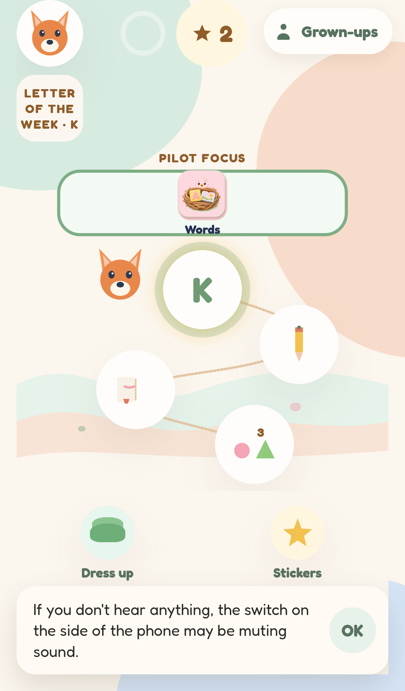
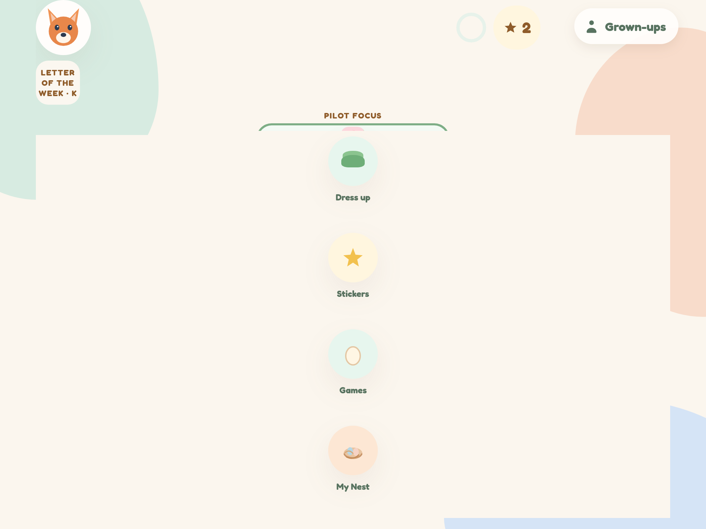
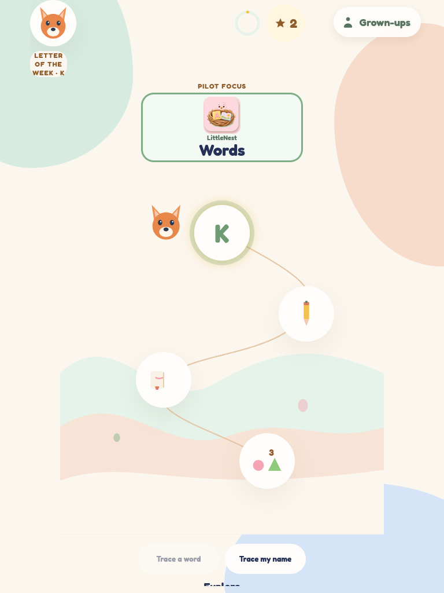
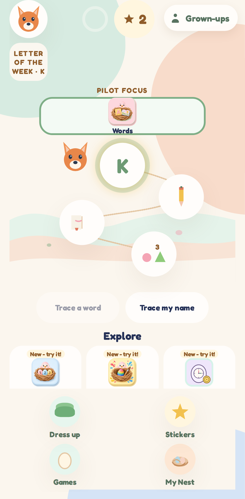
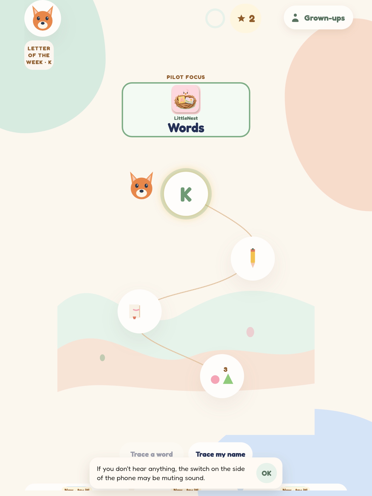

# Design and branding check

This note covers the branding and layout pass on `cursor/brand-design-df76`, then the full-stack QA pass on `cursor/final-qa-df76`.

Before shots are the parent branch `cursor/school-roster-df76`, opened in Chromium at iPhone 13 (390×844) and iPad landscape (1024×768). After shots are this branch, from Playwright on the iPhone 13 project and on Chromium at the same iPad size.

Natural-voice audio files are still not in the app. `public/audio` has no recordings, and `npm run generate-audio` was not run.

## What changed

| Check | Result |
| --- | --- |
| Maker credit is “TriageDesk AI LLC” on the start screen, About, privacy line, store copy, and the COPPA draft | Pass |
| Tagline “Made by a parent, for parents” on the start screen, About, and store copy | Pass |
| No personal name and no home address in the app or those docs | Pass |
| Story is a three-page read-along starring the child’s animal. The child’s name is not in the lines | Pass |
| Reading-path Colors step is a pastel tap (Pink / Sky / Butter), not a Soon card | Pass |
| Play library is hidden. Families do not see a Soon tile | Pass |
| Home shows Pilot focus, then the reading path, then Explore with “New - try it!” | Pass |
| Color tiles use soft pastel paints. Patterns stay, with a lighter ink. “Orange” and “diagonal” sit inside the Mix tile | Pass |
| Money play tiles include a picture. Lemonade has a cup, a 44px “Hear it”, and a 56px “Serve” | Pass |
| Clock “Hear it”, “Hour hand”, and “Minute hand” are compact (hand buttons at most 64px tall) | Pass |
| “Save child” uses the primary sage button. The add-child form is at most 440px wide and centered | Pass |
| Grown-ups rows have an icon in the circle, on the cream background | Pass |
| iPad landscape: the reading path and the Numbers tiles sit in the 768px-tall viewport | Pass |
| Letter stroke numbers are at least 12 units apart so “1” and “2” do not read as “21” | Pass |
| Build It “Play” stays inside the iPhone 13 viewport | Pass |

Playwright: `e2e/brand-design.spec.ts`, `e2e/grownups.spec.ts`, `e2e/rewards.spec.ts`, and `e2e/offline.spec.ts` passed on Chromium, Firefox, WebKit, iPhone 13, and Pixel 7 (79 passed, 11 skipped as project-specific). Unit tests: 164 passed.

The Explore row is the home layout only. Per-section error boundaries, namespaced storage, and the reward request API are not part of this change.

## Start screen

iPhone before, “by TriageDesk”:

iPhone after, tagline and TriageDesk AI LLC:

iPad before:

iPad after:

## Home

iPhone before, with Play library:

iPhone after, reading path first and Explore underneath:

iPad landscape before:

iPad landscape after:

Numbers on iPad before (tiles split around the shortcut column):

Numbers on iPad after (cards and tiles in one column):

## Story and color moment

iPhone before, Soon:

iPhone after, the fox story:

Color moment after:

## Colors, money, clock

Colors before:

Colors after:

Money play before (text only):

Money play after:

Lemonade before:

Lemonade after:

Clock before:

Clock after, iPhone and iPad:

## Add a child and Grown-ups

Add-child before, wide panel:

Add-child after, iPhone and iPad:

Grown-ups before (empty circles):

Grown-ups after:

## Tracing and Build It

Tracing before:

Tracing after:

Build It before (Play below the blocks):

Build It after (Play on screen):

## Full-stack QA

Checked again after the lesson-week, Hatch, and home-dock fixes.

| Check | Result |
| --- | --- |
| Product name LittleNest Learning, bundle id `com.triagedesk.littlenest`, storage keys `littlenest-*-v1` | Pass |
| Pastel tokens in `src/palette.ts` and `:root` | Pass |
| Store name “LittleNest Learning: Ages 3-7” and subtitle “Read, math, science & coding” | Pass |
| App icon name band from the earlier icon pass | Pass. Not regenerated |
| Natural-voice recordings | Not generated. `npm run generate-audio` exits until `GOOGLE_APPLICATION_CREDENTIALS` points at a Google Cloud Text-to-Speech service account. Letter sounds stay human-recorded and are not synthesized. `public/audio` has no mp3 files |
| Unit tests | 183 passed |
| Playwright on Chromium, Firefox, WebKit, iPhone 13, and Pixel 7 | 553 passed, 0 failed, 22 skipped (14.5m) |
| Playwright on iPad (gen 7) | 109 passed, 0 failed, 6 skipped |

Blend, tracing, star, cheer, tip, and learning-path specs seed reading week 0 (M and A) in `e2e/pinLesson.ts`, so a new letter of the week does not change them. The last letter match waits until the draw screen moves on. Hatch level 2 leaves the first letter showing when every letter in the word was taught. On a phone, and on a short tablet, the home dock stays inside the viewport with Science selected. That layout is also checked at iPhone 13 (390×664), iPad portrait (768×1024), and iPad landscape (1024×768).

PIN recovery, the five-family metrics floor, Explore crash isolation, and class QR specs passed inside this run.

### Preview deploy

The combined site is published from the branch named `preview` by the workflow **Preview and demo**. The main demo is `/Kids-app/` and the stack is `/Kids-app/preview/`.

GitHub Pages will not deploy that branch until `preview` is allowed on the `github-pages` environment (Settings → Environments → github-pages → Deployment branches). After it is allowed, re-run **Preview and demo** on the branch `preview` from Actions → Preview and demo → Run workflow. A later push to `preview` runs the same workflow.

A separate, unmerged change to the main Pages workflow builds the `preview` branch into `/Kids-app/preview/` on a future push to `main`, so that publish does not drop the preview site.

Home during this pass:

